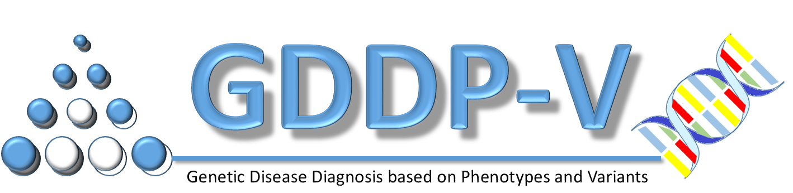
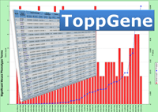

---
---

<link rel="stylesheet" href="styles.css" type="text/css">

#### GDDP

[GDDP](https://gddp.research.cchmc.org/) is a web application to demonstrate the methods that we developed to prioritize diagnosis of genetic diseases based on phenotypes. Method 1 is based on integrated semantic similarity and Method 2 is based on ontological overlap test between the phenotypes expressed by a patient and phenotypes annotated to known diseases. 

* Chen, Jing, et al. "Novel phenotype–disease matching tool for rare genetic diseases." Genetics in Medicine 21.2 (2019): 339-346.([link](https://www.nature.com/articles/s41436-018-0050-4))

***

#### GDDPV

GDDPV is a web application to prioritize pathogenic variants based on sequence data (VCF file) and phenotypes (free text) of a patient with genetic disease. Variants detected in a patient are annotated by allele frequencies, genes, and prioritized by phenotypes of the patient based on GDDP Method 2 separately for different inheritance patterns. 

The application is under development.

***

#### ToppGene
[ToppGene](https://toppgene.cchmc.org/) is a web application for gene list enrichment analysis and candidate gene prioritization based on functional annotations and protein interactions network. Gene list enrichment detects functional enrichment of a gene list based on Transcriptome, Proteome, Regulome (TFBS and miRNA), Ontologies (GO, Pathway), Phenotype (human disease and mouse phenotype), Pharmacome (Drug-Gene associations), literature co-citation, and other features. Functional annotation-based disease candidate gene prioritization integrates multiple functional annotations using a meta-analysis framework. The protein–protein interaction network (PPIN)-based disease candidate gene prioritization uses social and Web networks analysis algorithms (extended versions of the PageRank and HITS algorithms, and the K-Step Markov method). 

* Chen, Jing, et al. "ToppGene Suite for gene list enrichment analysis and candidate gene prioritization." Nucleic acids research 37.suppl_2 (2009): W305-W311.([link](https://academic.oup.com/nar/article/37/suppl_2/W305/1149611))
* Chen, Jing, Bruce J. Aronow, and Anil G. Jegga. "Disease candidate gene identification and prioritization using protein interaction networks." BMC bioinformatics 10.1 (2009): 73.([link](https://link.springer.com/article/10.1186/1471-2105-10-73))
* Chen, Jing, et al. "Improved human disease candidate gene prioritization using mouse phenotype." BMC bioinformatics 8.1 (2007): 392.([link](https://link.springer.com/article/10.1186/1471-2105-8-392))
