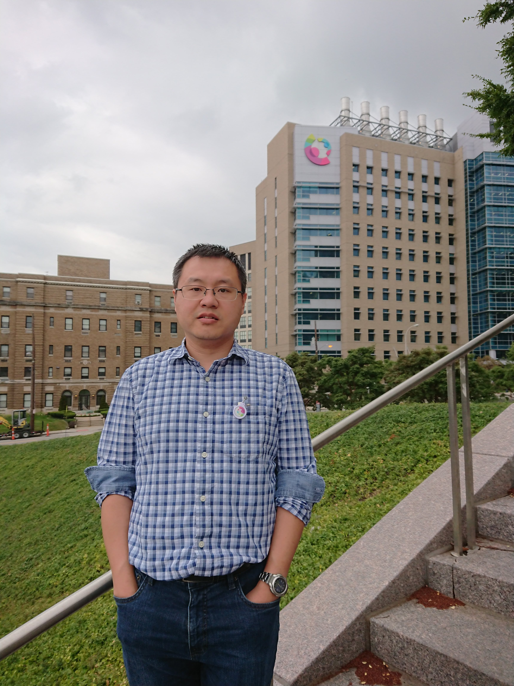

```{r include=FALSE, message=FALSE, warning=FALSE, error=FALSE}
library(shiny)
```

---
---

<link rel="stylesheet" href="styles.css" type="text/css">



I have always enjoyed working with big biomedical informatics data. I also like to help patients, espeically children. As an [assistant professor](https://www.cincinnatichildrens.org/bio/c/jing-chen) at [Cincinnati Children's Hospital Medical Center](https://www.cincinnatichildrens.org/) in the Division of Biomedical Informatics, my career allows me to combine these interests and pursue biomedical informatics research. 

I received my bachelor's degree in Computer Engineering from [National University of Singapore](http://nus.edu.sg/), and my PhD degree in Bioinformatics from [University of Cincinnati](http://www.uc.edu/). After graduation, I became a research scientist at [The Laboratory for Statistical Genomics and Systems Biology](http://eh3.uc.edu/) at University of Cincinnati. From 2014 to 2015, I worked as a computational biologist at GlaxoSmithKline, the world's sixth largest pharmaceutical company. I joined Cincinnati Children's Hospital Medical Center in 2015.

